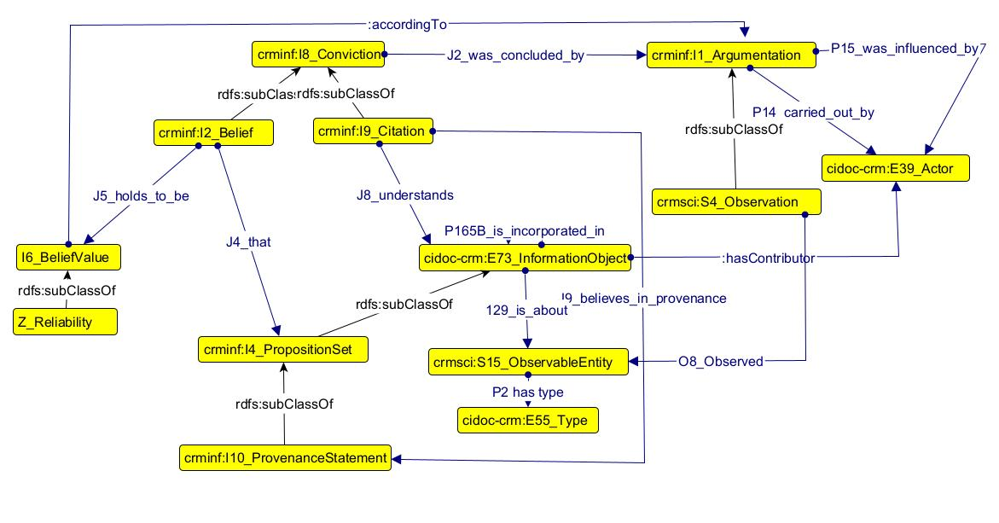

# An Ontology for Multivocality: Embracing Diverse Perspectives in Machine-Readable Form

In today's interconnected and diverse world, understanding and accommodating multiple perspectives, viewpoints, and languages is crucial. Multivocality refers to the coexistence of multiple voices or perspectives within a given context. The field of semantic technologies provides a powerful framework for representing knowledge in a machine-readable format through ontologies, also known as data models. By developing an ontology focused on multivocality, we can embrace diverse perspectives and foster a more inclusive and comprehensive machine-readable understanding of the world.

## A definition of multivocality

Multivocality involves recognizing and incorporating the existence of multiple voices, languages, and cultural perspectives within a particular domain. It acknowledges that different stakeholders or communities may have their own distinct terminologies, concepts, and interpretations. By considering these diverse perspectives, we can overcome biases, promote inclusivity, and avoid the imposition of a single dominant viewpoint.

## Multivocality in the Sloane Collections

Multivocality is highly relevan in the context of the Sloane Collections for several reasons. 

The Sloane Collections encompass a vast array of cultural artifacts, natural history specimens, and manuscripts gathered by Sir Hans Sloane during his lifetime. These collections originate from diverse regions, cultures, and time periods, representing the rich tapestry of human history and knowledge. Embracing multivocality allows us to acknowledge and appreciate the various perspectives, traditions, and narratives associated with these objects. Furthermore, as these items hold multiple interpretations, it is important to capture them to move beyond a single, flat interpretation imposed by a single disciplinary lens.

In particular, historical collections like the Sloane Collections often carry the baggage of colonial histories, where objects were acquired through imperialistic practices. Embracing multivocality allows us to acknowledge and address these biases by incorporating the perspectives and voices of communities whose cultural heritage may be represented within the collections. This approach promotes decolonization efforts and contributes to more inclusive and equitable narratives.

By doing so, it is possible to encourage public engagement with the Sloane Collections by providing platforms for diverse communities to contribute their knowledge, stories, and interpretations. By actively involving a broader range of voices, the collections become more accessible, relatable, and engaging to a wider audience. This approach promotes inclusivity, breaks down barriers, and fosters a sense of ownership and pride among various communities.

Research questions to address are:

1. What key aspects should be considered when designing an approach or framework that embraces multivocality within the cultural heritage domain?
2. How to simultaneously represent contrasting viewpoints and interpretations derived from an observation?

## Designing the Muitivocality Ontology

To create an ontology that captures multivocality, we must consider several key aspects:

1. Multiple Lexicons: The ontology should account for various terminologies, synonyms, and language variations associated with a given domain. By incorporating multiple lexicons, we can facilitate communication across diverse communities and bridge the gaps caused by language differences.

2. Contextual Relationships: An ontology focused on multivocality should represent the contextual relationships between concepts and the different perspectives associated with them. This allows for a nuanced understanding of how concepts are interpreted within specific cultural, linguistic, or disciplinary contexts.

3. Mapping and Alignment: Mapping and aligning concepts from different vocabularies is essential to establish connections and enable knowledge integration across diverse perspectives. This process involves identifying equivalent or similar concepts in different terminologies and creating relationships between them.

The data model extends the CRMinf and CRMsci ontologies to take into account these perspectives.

## Benefits and Applications

This ontology model offers several benefits and applications:

1. Cross-Cultural Collaboration: By embracing diverse perspectives and incorporating multiple vocabularies, the ontology promotes collaboration and understanding across different cultures, languages, and communities, and represents a comprehensive view on the history of artifacts..

2. Enhanced Data Integration: The ontology facilitates the integration of data from diverse sources, enabling interoperability and knowledge sharing between different systems and domains.

3. Customization: The ontology can be tailored to individual users' preferences or specific community needs, allowing for personalized information retrieval and user-driven knowledge organization.

4. Research and Decision-Making: The ontology supports comprehensive research and informed decision-making, for example in choosing exhibitions items and themes, by capturing various viewpoints, reducing biases, and providing a broader understanding of complex issues.

## Competency questions and use cases

The module addresses the following competency questions: 

1. How many proposition statements are there about an artifact?
2. What are all the belief values for a specific information entity?
3. Is there anyone who made an observation about someone else's belief value?
4. What are the types of statement made about an artifact that are common across information entities?
5. Whho are the contributors that contributed to an information entity?

Use cases for the Sloane Collections can be the following:

1. Accounts for different interpretations of plant speciments;
2. Addressing contribution of both documented and invisible collectors of plant specimens;
3. Contrasting opinion about material, provenance, technique, function, attribution of an object within information records;
4. Representing uncertainty about the function of an object;
5. The mention, or lack thereof, of an agent within information records;
6. Addressing contribution of both documented and invisible local knowledge sharers.

## Resources

1. [Ontology documentation](https://github.com/dersuchendee/SLCommunityFellowship/tree/main/Ontology%20documentation) 
2. [Ontology HTML visualisation](https://dersuchendee.github.io/MultivOntoWebsite/index-en.html)
